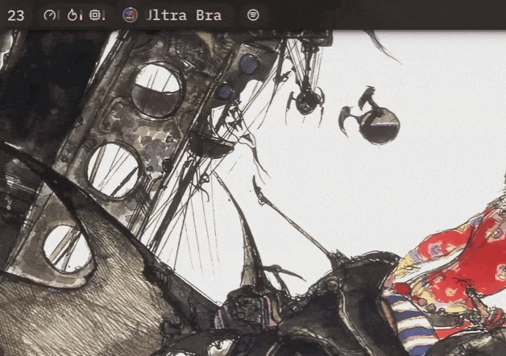

# Spotify Player Widget

Simple player widget for any Spotify client.

### Features

| Feature | Status |
|---|---|
| Track, album and playlist search from widget | Done |
| Listing user's own playlists | Done |
| Setting the player ID to control in settings | Done |
| Accessing playback from launcher | Planned |

### Requirements
- **Noctalia ≥ 4.7.6** (might work on earlier versions but hasn't been tested)
- **Python ≥ 3.6** for running callback server
- Spotify Premium account
- Any Spotify player (including non-local)

### Configuration

To use the widget, you need to get a Spotify API client ID and secret.

1. Go to https://developer.spotify.com/dashboard
2. Log in if you aren't already
3. Click "Create app"
4. Give your app any name and description
5. Set a redirect URI to http://localhost:8888 (or another port – make sure it's free!)
6. Select "Web API" in "APIs used".
7. Create the app.
8. In plugin settings, enter your client ID and secret, and change the callback port if you used a different one to 8888.
9. Click the "Request token" button and a browser window should open where you must authenticate your Spotify account.
10. Once you get redirected and the page tells you you can close the tab, you're done authenticating. 

Now you can optionally set the player ID you want the widget to control. You can get a list of currently active devices after authenticating by clicking "Get devices". Copy the device ID from the text area and paste it into the Player ID field, and you should be controlling that specific device now.

Your access token should refresh automatically whenever you open the widget panel, but if it expires, you can generate a new one by going back to the plugin settings and clicking "Request token" again.